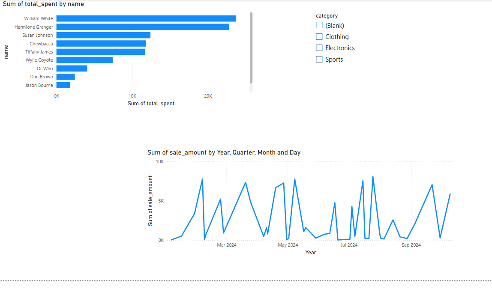
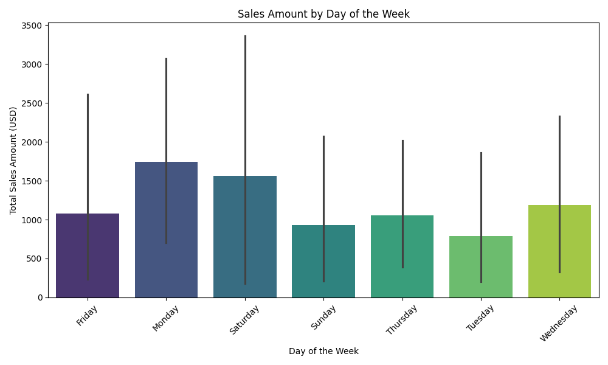
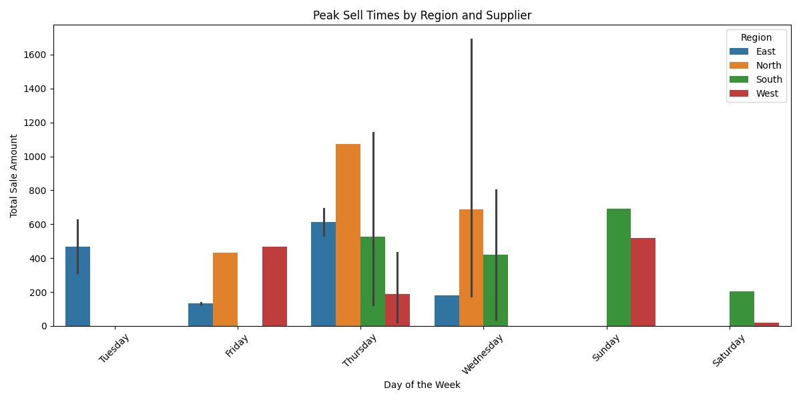

# smart-store-Hanson
Module 1 project for Business Analytics grad course


# Project 1 and 2
## Commands (for Windows 11, in PowerShell terminal in the root project folder)
### Step 2A - Create a Local Project Virtual Environment

```shell
py -m venv .venv
```

### Step 2B - Activate the Virtual Environment

```shell
.venv\Scripts\activate
```

### Step 2C - Install Packages

```shell
py -m pip install --upgrade -r requirements.txt
```

### Step 2D - Optional: Verify .venv Setup

```shell
py -m datafun_venv_checker.venv_checker
```

### Step 2E - Run the initial project script

```shell
py scripts/data_prep.py
```

-----

## Initial Package List

- pip
- loguru
- ipykernel
- jupyterlab
- numpy
- pandas
- matplotlib
- seaborn
- plotly
- pyspark==4.0.0.dev1
- pyspark[sql]
- git+https://github.com/denisecase/datafun-venv-checker.git#egg=datafun_venv_checker

# Project 3
## Step 3A - Create scripts/data_scrubber.py

```shell
ni data_scrubber.py
```

In your scripts folder in your project, create a file named: data_scrubber.py

Copy and paste the code from the example repo - https://github.com/denisecase/smart-sales-docs/

Complete the TODO tasks in the data_scrubber.py script

## Step 3B - Create tests/test_data_scrubber.py
```shell
ni test/test_data_scrubber.py
```
Create a folder in your project named: tests

Create a file in the test folder named: test_data_scrubber.py

Copy and paste the code from the example repo.

In the terminal, run the following command to test the DataScrubber:
```bash
py tests\test_data_scrubber.py
```
Verify that the test script ran without fail.

## Step 3C - Use the DataScrubber to execute data_prep.py

In the terminal, run the following command to run the data_prep.py script:
```bash
py scripts\data_prep.py
```

# Project 4

## Step 4A - Design Data Warehouse

Create a suitable schema for for your data warehouse (I used the star schema here).

## Step 4B - Create Data Warehouse

In the scripts folder, create a new file named etl_to_dw.py.

In the etl_to_dw.py file, copy and paste script from the example in the example repo and adjust to match your schema and prepared data. 

## Step 4C - Execute Script to Create Data Warehouse

Once adjusted, use terminal to execute the file by using the following command:
```bash
py scripts/etl_to_dw.py
```

# Project 5: Cross Platform Reporting with Power BI

## Step 5A - SQL Queries and Reports
- Created a Top Customer Query that joins the sales table with the customer table, adds up the sale amounts of each customer, and sorts the results from high to low. 
- Created a Top Customer bar chart to show the highest spending customers
- Created a Sales Trend line chart to show sales performance over time

## Power BI Model View
## Power BI Model View


## SQL Query Results


## Final Dashboard



# Project 6: BI Insights and Storytelling (OLAP Analysis - Purchase Frequencies)

## Business Goal
- The business goal is to determine which customers made purchases with the most frequency, and which days of the week have the highest frequency of sales.

## Data Source
- I used my prepared data warehouse from SQLite: data/dw/smart_sales.db
- The tables and columns used:
  - Sale: transaction_id, store_id, product_id, customer_id, Order_Date, sale_amount, Purchases
  - Product: product_id, category
  - Customer: customer_id

## Tools Used
- Python (Jupyter Notebook): for data querying, transformation, aggregation and visualization
- Pandas: Data manipulation
- Matplotlib: data visualization
- SQLite 3 - querying the data from the data warehouse 

## Results


# Project 7: Custom BI Project

## The Business Goal
A comparison of peak sell times by product, supplier and region.

## Data Source
Data Warehouse constructed from etl_to_dw.py using the csv files cleaned and output by the scripts in data_preparation and data_prep.py, data_scrubber.py

## Tools Used
- Pandas
- Matplotlib
- Pathlib
- Sys
- SQLite
- Seaborn
- Numpy

## Workflow and Logic
Group transactions by the date of sale and customer ID.
Average the number of sales per customer per day of the week.
Sum SaleAmount for each day of the week.
Identify the day with the lowest total revenue.

## Results


